
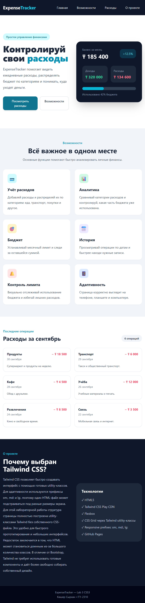
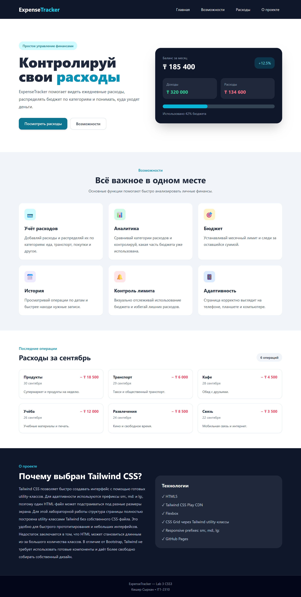

# Lab 3 — ExpenseTracker

## Студент

**Көшер Сырхан**

## Группа

**IT1-2310**

## Трек

**A — Tailwind CSS**

## Тема

**Учёт расходов**

## Репозиторий

`landing-kosher`


## GitHub Pages

Сайт проекта:

https://syrkhann.github.io/landing-kosher/

---

## О проекте

ExpenseTracker — это адаптивная landing page для демонстрации интерфейса учёта личных расходов.

В проекте используются HTML5 и Tailwind CSS через Play CDN.

Страница содержит:
- навигационное меню;
- главный экран;
- информацию о бюджете;
- карточки возможностей;
- список расходов;
- информацию о проекте.

---

## Как запустить

1. Скачайте или клонируйте репозиторий.
2. Откройте файл `index.html` в браузере.
3. Для загрузки Tailwind CSS через Play CDN требуется подключение к интернету.
4. Для проверки адаптивности откройте DevTools в браузере.
5. Проверьте сайт на ширинах **375 px, 768 px и 1280 px**.

---

## Требования Lab 3

### Адаптив

### Скриншоты адаптивности

#### 375 px — телефон


#### 768 px — планшет


#### 1280 px — desktop


На маленьком экране меню располагается вертикально, а на более широком экране переходит в горизонтальное положение.

Для карточек используется адаптивная Grid-сетка:

```html
grid grid-cols-1 md:grid-cols-2 lg:grid-cols-3
